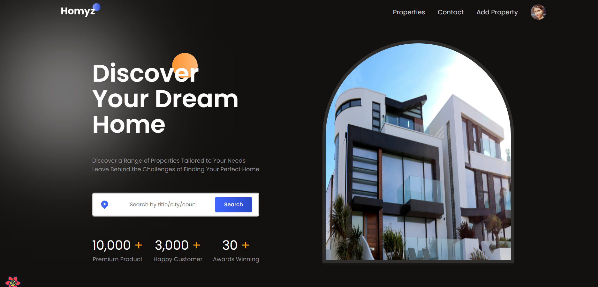
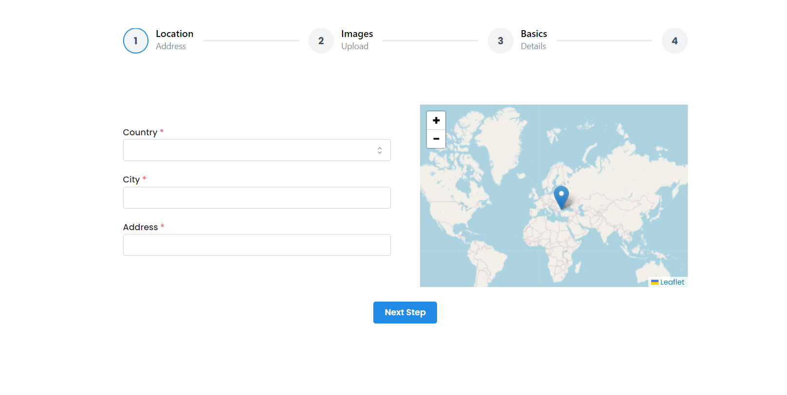

# Real Estate - Real Estate Website

Homyz is a cutting-edge real estate web application developed using the powerful MERN stack (MongoDB, Express.js, React, Node.js). It serves as a comprehensive platform for users to seamlessly search, list, book, and explore a diverse range of properties available for sale or rent. The application is designed with a user-centric approach, offering an intuitive interface that simplifies property browsing and transactions.

## Features

- *Property Listings*: View a wide range of property listings with detailed information, including descriptions, prices, addresses, and more.

- *Advanced Search*: Customize your property search by type (rent/sale), amenities, sorting options, and more.

- *User Profiles*: Registered users can create and manage their profiles with profile pictures and listings also.

- *Authentication*: Secure user registration and login functionality with Google OAuth.

- *Book your Visit*: you can also select the date at which you want to visit the site.

- *Maps and Location Information*: Integrating maps and providing location information is crucial for real estate and hospitality websites. Interactive maps can show the location of properties, nearby amenities (e.g., schools, restaurants, hospitals), transportation options, and other points of interest. This helps users understand the neighborhood and make informed decisions.

- *Mark as Favourites*: you can also mark as favourite the property which you like.

- *Property Details and Descriptions*: Each property listing should have comprehensive details and descriptions, including property features, room dimensions, amenities, nearby attractions, and any unique selling points. High-quality images and virtual tours can provide a more immersive experience for users.

## Installation

1. Clone the repository:

   bash
   git clone https://github.com/kajalpandey25/real-estate-booking.git
   

2. Change into the project directory:
   bash
   cd real-estate-booking
   
3. Install server dependencies:

   bash
   npm install
   

4. Install client dependencies:

   bash
   cd client
   npm install
   

5. Create a .env file in the root directory with your configuration settings.

   bash
   MONGO = "MONGODB URI"
   JWT_SECRET = "JWTSECRET"
   

6. Start the development server:

   bash
   npm run dev

## Usage

- Explore property listings, customize your search, and create a user profile to list properties or access additional features.

## Contributing

Contributions are welcome! Please follow these steps to contribute to the project:

1. Fork the repository.
2. Create a new branch for your feature or bug fix:

   bash
   git checkout -b feature/your-feature-name
   

3. Make your changes and commit them:

   bash
   git commit -m "Your commit message here"
   

4. Push your changes to your fork:

   bash
   git push origin feature/your-feature-name
   

5. Create a pull request to the main repository.

## Contact

1. [GITHUB](https://github.com/kajalpandey25)
2. [LINKEDIN](https://www.linkedin.com/in//kajal-pandey-08b312260/)
